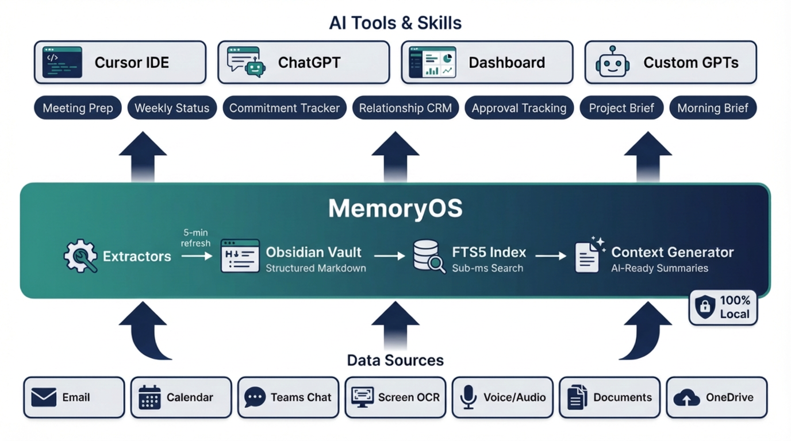
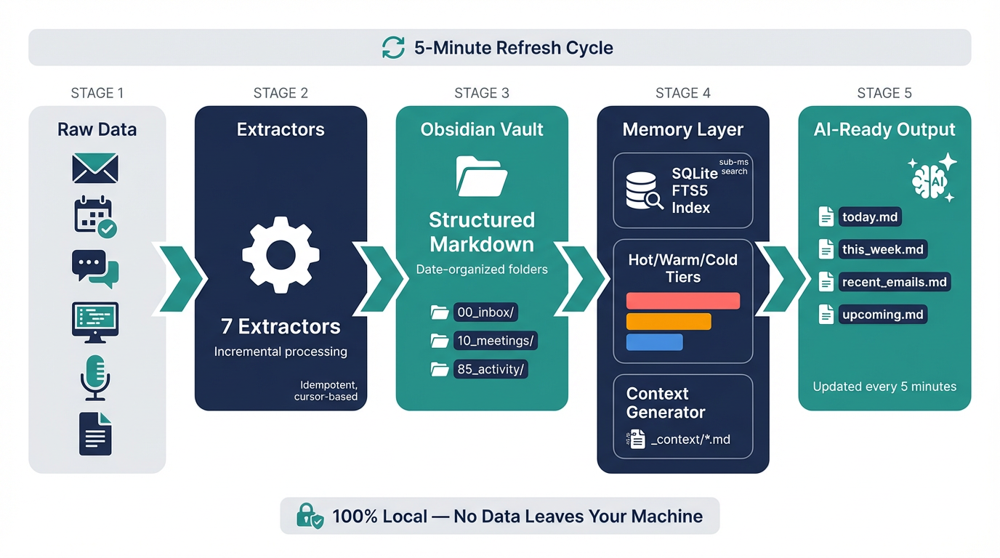
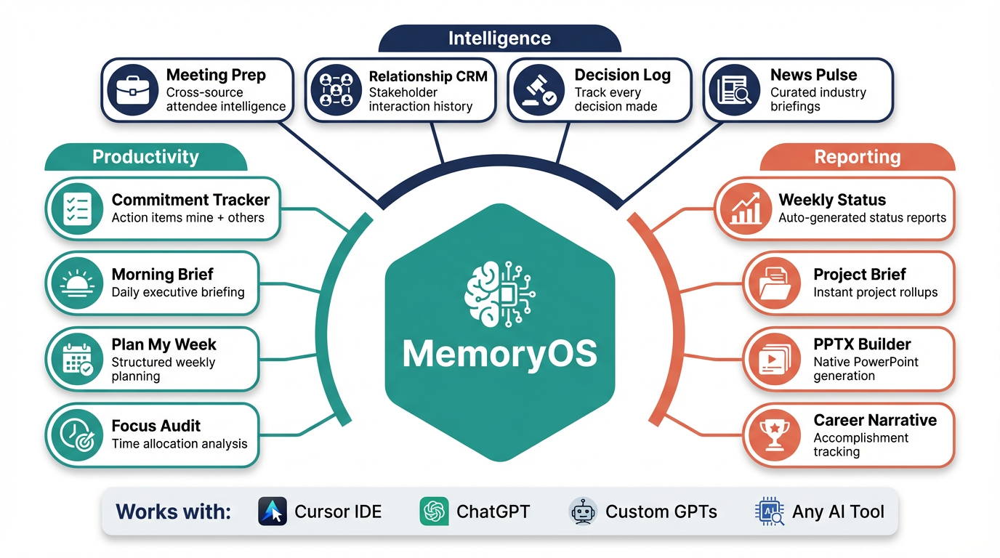

# MemoryOS

A local-first memory pipeline for macOS that captures everything you do, see, hear, and read -- structures it as searchable Markdown -- and makes it instantly available to any AI tool. 100% local. No data leaves your machine.



## How It Works

MemoryOS continuously indexes your work context -- emails, meetings, screen activity, documents, and conversations -- into a structured Obsidian vault. A SQLite FTS5 index provides sub-millisecond search across everything. Context files are regenerated every 5 minutes so your AI tools always have fresh, complete situational awareness.



| Source | How | Output |
|--------|-----|--------|
| Screen activity | OCR every ~2 seconds via Screenpipe | `85_activity/YYYY/MM/DD/daily.md` |
| Your voice | Microphone transcription (Screenpipe) | `10_meetings/YYYY/MM/DD/audio.md` |
| Meeting audio | System audio via BlackHole loopback | `10_meetings/YYYY/MM/DD/audio.md` |
| Emails | Mail.app, Outlook Classic, or Microsoft Graph API | `00_inbox/YYYY/MM/DD/*.md` |
| Calendar | Calendar.app, Outlook, or Graph API | `10_meetings/YYYY/MM/DD/calendar.md` |
| Teams chat | Screen OCR when Teams is active | `20_teams-chat/YYYY/MM/DD/teams.md` |
| Documents | OneDrive files (docx, pptx, pdf, xlsx) | `40_slides/` and `50_knowledge/` |

## Skills & Capabilities

MemoryOS is the data layer. On top of it, modular AI skills turn context into action. Any AI tool -- Cursor, ChatGPT, custom GPTs -- can invoke these skills against your full work history.



## Using the System

Once running, MemoryOS generates two things: raw Markdown files (detailed, per-item) and context files (summaries optimized for AI consumption). Here's how to use them with different tools.

### With Cursor (Primary IDE)

**Add your vault to the workspace.** Open Cursor, add your Obsidian vault folder (or at minimum, the `_context/` subfolder) to your workspace.

**Reference context files with @:**

- `@_context/today.md` -- "What meetings do I have today? What emails came in?"
- `@_context/this_week.md` -- "Summarize what I worked on this week"
- `@_context/recent_emails.md` -- "Any emails about the budget proposal?"
- `@_context/upcoming.md` -- "What's on my calendar next week?"

**Use the CLI in Cursor's terminal for deeper searches:**

```bash
python3 -m src.memory.cli search "quarterly review"
python3 -m src.memory.cli recent --hours 48 --type email
python3 -m src.memory.cli meetings
python3 -m src.memory.cli stats
```

### With ChatGPT Enterprise

- Upload `_context/today.md` or `_context/this_week.md` as attachments for situational context
- Use the CLI to generate targeted context, then copy/paste:
  ```bash
  python3 -m src.memory.cli search "project alpha" 
  ```
- For recurring workflows, create a custom GPT with instructions about your data format

### With AI Agents

MemoryOS is designed as the **data layer** for AI agents:

- **Read**: Agents read `_context/` files for situational awareness, or import `src.memory.index.MemoryIndex` directly for programmatic queries
- **Query**: Agents call the CLI or use the Python API for search
- **Act**: Agents propose actions (draft replies, schedule items) via the dashboard API
- **Approve**: Human-in-the-loop review through the dashboard at `http://localhost:8765`

See [ARCHITECTURE.md](ARCHITECTURE.md) for the full agent integration pattern.

## Quick Start

You need a Mac running macOS 13+ (Ventura or later). The installer handles everything else.

```bash
git clone https://github.com/Brianletort/MemoryOS.git ~/.memoryos
cd ~/.memoryos
./install.sh
```

The installer will:
1. Install system dependencies (Homebrew, Python 3.12, pandoc)
2. Create a Python virtual environment and install all packages
3. Open the **Setup Wizard** in your browser at http://localhost:8765

The Setup Wizard walks you through:
- **Dependencies** -- verifies everything is installed
- **Configure** -- set your Obsidian vault path, email source, calendar source
- **AI Agents** -- pick your LLM provider (OpenAI, Anthropic, Gemini, Ollama) and enter your API key
- **Activate** -- installs background agents, runs your first extraction, builds the search index

After the wizard completes, MemoryOS runs automatically in the background. Data starts flowing into your vault within minutes.

### Chat Frontend

The installer sets up the chat frontend as a launchd service. To run it manually for development:

```bash
cd frontend
cp .env.example .env.local
npm install
npm run dev
```

The chat UI will be available at `http://localhost:3000`.

### macOS Permissions

After setup, grant Full Disk Access to Python so email and calendar extraction runs without popups:

```bash
./scripts/grant_permissions.sh
```

### Managing MemoryOS

```bash
./scripts/memoryos start       # Start all background agents
./scripts/memoryos stop        # Stop all background agents
./scripts/memoryos status      # Show what's running
./scripts/memoryos doctor      # Full health check
./scripts/memoryos logs        # Tail the combined log
./scripts/memoryos update      # Pull latest code and reinstall
./scripts/memoryos uninstall   # Remove all agents (keeps your data)
```

## Voice & Screen Capture (Optional)

MemoryOS captures email, calendar, documents, and Teams chat out of the box. For **screen activity** (OCR) and **voice transcription** from meetings, you need a separate capture tool:

- **[Screenpipe](https://screenpipe.com)** -- open-source screen + audio capture. Install from screenpipe.com or `brew install screenpipe`.
- **Scribe** -- alternative capture tool with the same Obsidian output format.

Both write structured Markdown into your Obsidian vault. MemoryOS picks up whatever they produce. Without a capture tool, everything else still works -- you just won't have screen activity or meeting transcripts.

The Setup Wizard checks for Screenpipe automatically and shows its status.

## Privacy

MemoryOS runs **entirely locally**. No data leaves your machine unless you explicitly upload it.

- **Privacy mode**: Create `config/.privacy_mode` to instantly disable all audio capture
- **WiFi-based auto-privacy**: Automatically enables privacy mode on untrusted networks
- **Work hours filter**: Only capture audio during configured hours
- **Work app correlation**: Only keep audio when work apps are active on screen
- **Minimum word filter**: Discard tiny audio fragments (noise)

Toggle privacy from the dashboard, CLI, or:

```bash
./scripts/privacy_toggle.sh
```

## Dashboard

The web dashboard provides monitoring and control at `http://localhost:8765`:

- **Overview**: extractor status, launchd agent health, privacy controls
- **Pipeline**: folder health, activity timeline, watchdog status
- **File Browser**: browse and preview vault Markdown files
- **Logs**: live extractor log viewer
- **Settings**: trusted networks, work apps, audio filters
- **Skills**: installed Cursor agent skills

The dashboard runs automatically via launchd. To start manually: `python3 src/dashboard/app.py`

## Chat Interface

MemoryOS includes a full-stack chat interface that connects directly to your memory vault. It runs as a Next.js app at `http://localhost:3000` backed by the FastAPI server at `http://localhost:8765`.

- **Persistent sessions** -- conversations are saved to SQLite and exported as Markdown into your Obsidian vault (`95_chat/`)
- **Streaming responses** -- real-time SSE streaming with visible tool execution trace
- **Auto-RAG** -- the agent automatically searches your vault, emails, meetings, and activity to answer questions
- **File upload** -- drag-and-drop files (PDF, DOCX, PPTX, XLSX, CSV) with automatic text extraction
- **PowerPoint generation** -- build slide decks from natural language descriptions
- **Model selection** -- choose between default, thinking (high reasoning), and pro models
- **Web search** -- toggle live web search for questions that need current information

### Running the Chat UI

The chat frontend runs automatically via launchd after setup. For development:

```bash
cd frontend
cp .env.example .env.local    # API URL defaults to http://localhost:8765
npm install
npm run dev                    # http://localhost:3000
```

Make sure the backend is running (`python3 src/dashboard/app.py` or via launchd).

## System Monitoring

MemoryOS includes a built-in **watchdog** that monitors every component and sends macOS notifications when something breaks or recovers. Notifications fire only on **state transitions** (healthy to degraded, or recovered), not repeatedly.

```bash
python3 src/monitor/watchdog.py --status
```

The dashboard also exposes watchdog status at `GET /api/watchdog`.

---

<details>
<summary><strong>Prerequisites</strong></summary>

The installer handles all of these, but for reference:

| Dependency | Installed by | Purpose |
|------------|-------------|---------|
| Homebrew | `install.sh` | macOS package manager |
| Python 3.9+ | `install.sh` via Homebrew | Runtime |
| pandoc | `install.sh` via Homebrew | Document conversion (docx/pptx to Markdown) |
| BlackHole 2ch | `install.sh` via Homebrew | Virtual audio driver for meeting capture (optional) |
| Obsidian | User installs | Knowledge base UI ([obsidian.md](https://obsidian.md)) |
| Screenpipe or Scribe | User installs | Screen OCR + voice transcription (optional) |

### Microsoft Graph API (Optional)

If you use Microsoft 365 and want richer email/calendar data (full HTML bodies, detailed events), you can connect via the Graph API. This requires an Azure AD app registration:

1. Go to [Azure Portal > App Registrations](https://portal.azure.com/#view/Microsoft_AAD_RegisteredApps/ApplicationsListBlade)
2. Click **New registration**, name it `MemoryOS`
3. Supported account types: **Accounts in any organizational directory and personal Microsoft accounts**
4. Redirect URI: leave blank (device code flow)
5. Copy the **Application (client) ID** and enter it in the Setup Wizard

If you don't need Graph API, skip this entirely. Mail.app and Calendar.app work out of the box.

</details>

<details>
<summary><strong>Configuration</strong></summary>

The Setup Wizard creates `config/config.yaml` and `.env.local` for you. To edit them manually:

```bash
$EDITOR config/config.yaml    # Paths, email source, privacy settings
$EDITOR .env.local             # API keys (never committed to git)
```

### Email & Calendar -- Pick Your Path

**Easy path** (default): macOS Mail.app + Calendar.app. If your email accounts are configured in **System Settings > Internet Accounts**, you're done.

**Outlook Classic**: If you use Outlook for Mac in Classic mode (not "New Outlook"), select Outlook in the Setup Wizard. **Note:** "New Outlook" uses cloud-only storage -- the extractor auto-detects this and falls back to Mail.app.

**Microsoft Graph API**: For full HTML email bodies and detailed calendar data from M365. Requires Azure AD app registration (see above).

### OneDrive (Optional)

Set your OneDrive sync folder in the Setup Wizard to automatically convert documents (docx, pptx, pdf, xlsx) to searchable Markdown.

### Environment Variable Overrides

| Variable | Config key |
|----------|-----------|
| `MEMORYOS_OBSIDIAN_VAULT` | `obsidian_vault` |
| `MEMORYOS_SCREENPIPE_DB` | `screenpipe.db_path` |
| `MEMORYOS_OUTLOOK_DB` | `outlook.db_path` |
| `MEMORYOS_ONEDRIVE_DIR` | `onedrive.sync_dir` |
| `MEMORYOS_STATE_FILE` | `state_file` |
| `MEMORYOS_LOG_DIR` | `log_dir` |

</details>

<details>
<summary><strong>Background Agents</strong></summary>

After activation, these launchd agents run automatically:

| Agent | Interval | Purpose |
|-------|----------|---------|
| `com.memoryos.screenpipe` | 5 min | Screen OCR + audio transcription extraction |
| `com.memoryos.mail-app` | 5 min | Email from Mail.app via AppleScript |
| `com.memoryos.calendar-app` | 5 min | Calendar from Calendar.app via AppleScript |
| `com.memoryos.outlook` | 5 min | Email + calendar from Outlook Classic DB |
| `com.memoryos.onedrive` | 15 min | Document conversion (docx, pptx, pdf, xlsx) |
| `com.memoryos.indexer` | 5 min | Full-text search index + context file generation |
| `com.memoryos.dashboard` | Continuous | Web dashboard on port 8765 |
| `com.memoryos.watchdog` | Continuous | Health monitoring with macOS notifications |
| `com.memoryos.wifi-monitor` | 60 sec | WiFi-based auto-privacy mode |
| `com.memoryos.morning-brief` | Daily 4 AM | AI morning briefing |
| `com.memoryos.weekly-status` | Weekly | AI weekly status report |
| `com.memoryos.commitment-tracker` | Scheduled | Track action items and follow-ups |
| `com.memoryos.news-pulse` | Scheduled | Curated industry news briefing |
| `com.memoryos.chat-frontend` | Continuous | Next.js chat UI on port 3000 |
| `com.memoryos.activity-summarizer` | 30 min | LLM-powered screen activity summaries |
| `com.memoryos.resource-monitor` | 5 min | System resource monitoring |
| `com.memoryos.approvals-queue` | 15 min | Pending approvals tracker |

### Running Extractors Manually

```bash
python3 src/extractors/screenpipe_extractor.py
python3 src/extractors/mail_app_extractor.py
python3 src/extractors/outlook_extractor.py
python3 src/extractors/calendar_app_extractor.py
python3 src/extractors/onedrive_extractor.py
```

All extractors support `--dry-run` to preview output without writing files.

### Initial Backfill (Optional)

```bash
python3 src/extractors/outlook_extractor.py --backfill
python3 src/extractors/mail_app_extractor.py --days-back 365
python3 -m src.memory.cli reindex --full
```

</details>

<details>
<summary><strong>Audio Capture Setup</strong></summary>

For useful meeting transcripts, Screenpipe needs to hear **both** sides of a call -- your microphone and the system audio from other participants.

1. **Install BlackHole**: `brew install blackhole-2ch`
2. **Create Multi-Output Device**: Open Audio MIDI Setup > **+** > Create Multi-Output Device. Check your speakers **and** BlackHole 2ch.
3. **Route system audio**: System Settings > Sound > Output > select the Multi-Output Device.
4. **Configure Screenpipe**: Add BlackHole 2ch as an audio **input** device in Screenpipe settings.
5. **Verify**: Join a test call and confirm both sides are captured.

### Audio filtering

Audio noise is controlled in `config/config.yaml` under `privacy`:

- **work_apps**: Audio is only kept when one of these apps was on-screen within 2 minutes.
- **work_hours_only**: When `true`, audio outside configured hours is filtered.
- **min_words**: Fragments shorter than this word count are filtered.

Filtered audio is never deleted -- it goes into a collapsible `<details>` section at the bottom of each audio note.

</details>

<details>
<summary><strong>Dashboard API</strong></summary>

| Endpoint | Description |
|----------|-------------|
| `GET /api/status` | Overall system status with extractor health |
| `GET /api/pipeline-health` | Per-folder file counts, freshness, health |
| `GET /api/watchdog` | Latest watchdog check results |
| `GET /api/timeline/{date}` | Hour-by-hour activity for a given date |
| `GET /api/browse?path=` | Browse vault files |
| `GET /api/file?path=` | Preview a vault Markdown file |
| `POST /api/run/{extractor}` | Manually trigger an extractor run |
| `POST /api/agent/{name}/{action}` | Control launchd agents (start/stop/restart) |
| `GET /api/sessions` | List chat sessions |
| `POST /api/sessions` | Create a new chat session |
| `GET /api/sessions/{id}` | Get session with message history |
| `POST /api/chat` | SSE streaming chat (agent loop with auto-RAG) |
| `POST /api/files/upload` | Upload file with automatic text extraction |
| `GET /api/files/download/{name}` | Download a generated or uploaded file |
| `POST /api/pptx/build` | Build a PowerPoint deck from a JSON spec |

</details>

<details>
<summary><strong>CLI Reference</strong></summary>

```bash
python3 -m src.memory.cli search "query"              # Full-text search
python3 -m src.memory.cli search "query" --type email  # Filter by type
python3 -m src.memory.cli recent --hours 24            # Last 24 hours
python3 -m src.memory.cli recent --type meetings       # Recent meetings
python3 -m src.memory.cli meetings --date 2026-02-19   # Specific date
python3 -m src.memory.cli stats                        # Index statistics
python3 -m src.memory.cli reindex                      # Incremental reindex
python3 -m src.memory.cli reindex --full               # Full reindex
```

Source types: `email`, `meetings`, `teams`, `activity`, `knowledge`, `slides`

### Watchdog CLI

```bash
python3 src/monitor/watchdog.py --status    # Print current health status
python3 src/monitor/watchdog.py --quiet     # Check health without notifications
python3 src/monitor/watchdog.py             # Check health and notify on changes
```

</details>

<details>
<summary><strong>Logs</strong></summary>

- Application: `logs/memoryos.log` (rotating, 5 MB, 3 backups)
- Per-extractor: `logs/*_launchd.log` and `logs/*_launchd.err`
- Dashboard: `logs/dashboard.log`
- Indexer: `logs/indexer.err`
- Watchdog: `logs/watchdog.err`

</details>

<details>
<summary><strong>Troubleshooting</strong></summary>

**Extractors not running?**
1. Check launchd status: `launchctl list | grep memoryos`
2. Check logs: `tail -f logs/memoryos.log`
3. Run manually with `--dry-run` to test
4. Verify paths in `config/config.yaml`

**Missing email data?**
1. If using **New Outlook** for Mac: the local SQLite DB is not updated. The Outlook extractor auto-detects this and logs a warning. Use the mail_app extractor (Mail.app) or Graph API instead.
2. If using **Mail.app**: ensure the app is running and has finished syncing. AppleScript queries can time out during active sync.
3. Check `config/state.json` for cursor positions.
4. Run with `--reset` to reprocess from scratch.

**Audio not capturing?**
1. Verify Screenpipe is running and healthy: `curl http://localhost:3030/health`
2. Check BlackHole is installed: `brew list blackhole-2ch`
3. Verify Audio MIDI Setup has the Multi-Output Device
4. Check privacy mode: `test -f config/.privacy_mode && echo "ON" || echo "OFF"`

**Screen recording degraded?**
1. Check Screenpipe health: `curl -s http://localhost:3030/health | python3 -c "import sys,json; d=json.load(sys.stdin); print(d['frame_status'], d.get('message',''))"`
2. If frame_status is "stale": try restarting Screenpipe
3. If drop rate is high: toggle Screen Recording permission off/on in **System Settings > Privacy & Security > Screen Recording**
4. High-resolution multi-monitor setups may see higher drop rates

**Dashboard not loading?**
1. Check if it's running: `curl -s http://localhost:8765/api/status`
2. Check for port conflicts: `lsof -i :8765`
3. Restart via launchd: `launchctl kickstart -k gui/$(id -u)/com.memoryos.dashboard`
4. The dashboard auto-kills stale processes on startup, but manual cleanup may be needed after crashes

**Watchdog not alerting?**
1. Check watchdog state: `python3 src/monitor/watchdog.py --status`
2. Check logs: `tail -f logs/watchdog.err`
3. Verify macOS notification permissions for `osascript` in **System Settings > Notifications**
4. Alerts fire only on state transitions, not repeatedly for ongoing issues

**Index empty?**
1. Run `python3 -m src.memory.cli reindex --full`
2. Check vault path in config: `grep obsidian_vault config/config.yaml`

</details>

<details>
<summary><strong>Project Structure</strong></summary>

```
MemoryOS/
├── install.sh                    # Single-command installer (start here)
├── .env.example                  # Environment variable template
├── requirements.txt              # Python dependencies
├── config/
│   ├── config.yaml.example       # Config template (committed)
│   ├── config.yaml               # Your personal config (gitignored)
│   ├── state.json                # Extractor cursors (gitignored)
│   ├── memory.db                 # SQLite FTS5 index (gitignored)
│   └── watchdog_state.json       # Watchdog health state (gitignored)
├── src/
│   ├── extractors/               # Data extraction modules
│   │   ├── screenpipe_extractor.py    # Screen OCR + audio transcription
│   │   ├── outlook_extractor.py       # Outlook Classic SQLite DB
│   │   ├── mail_app_extractor.py      # Mail.app via AppleScript
│   │   ├── calendar_app_extractor.py  # Calendar.app via AppleScript
│   │   ├── onedrive_extractor.py      # Document conversion
│   │   └── activity_summarizer.py     # LLM-powered activity summaries
│   ├── common/                   # Shared utilities
│   │   ├── config.py             # Config loader with env var overrides
│   │   ├── state.py              # Cursor state management (atomic writes)
│   │   ├── markdown.py           # Markdown helpers (sanitize, dedup, write)
│   │   └── outlook_body.py       # Email body extraction via mdimport
│   ├── memory/                   # Memory system
│   │   ├── index.py              # SQLite FTS5 index
│   │   ├── indexer.py            # Vault scanner + context generator
│   │   ├── tier.py               # Hot/warm/cold classification
│   │   ├── context.py            # Context file generator
│   │   └── cli.py                # Command-line interface
│   ├── agents/                   # AI agent system
│   │   ├── skill_runner.py       # Headless skill execution (morning brief, etc.)
│   │   ├── agent_loop.py         # Agentic chat with auto-RAG + tool loop
│   │   ├── tools.py              # Agent tools (search, vault, email, web)
│   │   └── llm_provider.py       # LLM abstraction (OpenAI, Anthropic, etc.)
│   ├── chat/                     # Chat system
│   │   ├── routes.py             # FastAPI chat endpoints (SSE streaming)
│   │   ├── store.py              # SQLite session/message persistence + Obsidian export
│   │   ├── file_handler.py       # File upload with text extraction
│   │   └── pptx_builder.py       # PowerPoint generation from chat
│   ├── analyzers/                # Data analysis modules
│   │   └── activity_summarizer.py # Screen activity pattern analysis
│   ├── monitor/                  # System health monitoring
│   │   ├── watchdog.py           # Component health checks + macOS notifications
│   │   ├── resource_monitor.py   # System resource monitoring
│   │   └── approvals_monitor.py  # Pending approvals tracker
│   └── dashboard/
│       ├── app.py                # FastAPI web dashboard + Setup Wizard
│       └── report_fallback.py    # Fallback report generation
├── frontend/                     # Next.js chat application
│   ├── src/
│   │   ├── app/                  # App Router pages
│   │   ├── components/           # React components (chat, dashboard, skills)
│   │   ├── lib/                  # API client, hooks, utilities
│   │   └── stores/               # Zustand state management
│   ├── package.json              # Node.js dependencies
│   └── .env.example              # Frontend environment template
├── tests/                        # Test suite
├── scripts/
│   ├── memoryos                  # CLI: start, stop, status, doctor, update
│   ├── setup.sh                  # Developer setup (lightweight, no system deps)
│   ├── install_launchd.sh        # Install launchd agents from templates
│   ├── grant_permissions.sh      # macOS permissions helper
│   └── smoke_test.sh             # Test all extractors
├── launchd/                      # Agent templates (.plist.template)
└── ARCHITECTURE.md               # System design & roadmap
```

</details>

## Architecture

See [ARCHITECTURE.md](ARCHITECTURE.md) for the full system design, including:
- Memory system with hot/warm/cold data tiers
- How the indexer and context generator work
- Agent integration patterns (read/query/act/approve)
- Future roadmap (vector embeddings, semantic search, agent framework)
